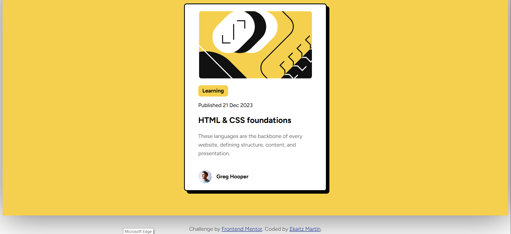
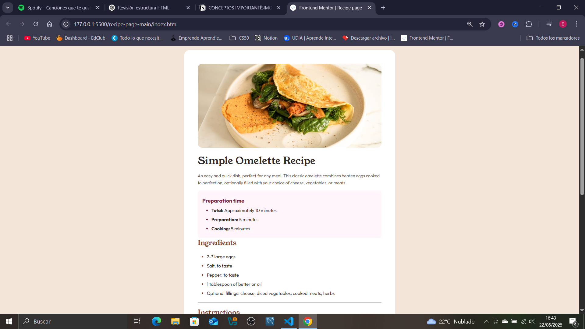

# 🧠 Frontend Mentor Projects Collection

This repository contains a collection of challenges completed from [Frontend Mentor](https://www.frontendmentor.io/), organized into separate folders. Each project is built using HTML, CSS, and sometimes a bit of JavaScript, with the goal of practicing modern frontend development techniques and clean, responsive layouts.

---
## 🎯 Goals of This Repository
Improve my layout and responsive design skills

Apply accessibility and code structure best practices

Prepare for more advanced projects using frameworks like React

Build a professional portfolio that reflects my growth as a frontend developer

---

## 📂 Project Index

### 1. 📘 Blog Preview Card

**Description**: A clean blog preview card layout. Great for practicing Flexbox layouts and using CSS variables.

📁 [Go to project](./blog-preview-card-main)  
📸 Preview image:  


---

### 2. 📱 QR Code Component

**Description**: A simple QR code component — perfect for practicing alignment, centering, and responsive basics.

📁 [Go to project](./qr-code-component-main)  
📸 Preview image:  


---

### 3. 🥗 Recipe Page

**Description**: A recipe webpage focused on semantic structure, clean styles, and mobile-first design.

📁 [Go to project](./recipe-page-main)  
📸 Preview image:  


---

### 4. 🧑‍💻 Social Links Profile

**Description**: A profile card with social media links. Useful for practicing spacing, color usage, and visual hierarchy.

📁 [Go to project](./social-links-profile-main)  
📸 Preview image:  


---

## 🛠️ Technologies Used

- HTML5
- CSS3 (including variables and responsive design)
- Flexbox
- CSS Grid (in some projects)
- Semantic markup and accessibility best practices

---

## 📬 Contact
Got feedback or ideas?

[](https://www.instagram.com/eekaa_29/)
[](https://www.tiktok.com/@em.codex)
[](https://www.youtube.com/@EkaitzMartin29)
[](https://github.com/eekaa29)


---

## 🚀 How to Clone This Repo

```bash
git clone https://github.com/your-username/your-repo-name.git
cd your-repo-name
