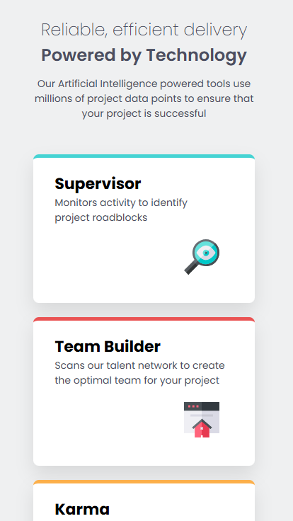

## Table of contents

- [Preview](#-preview)
  - [Links](#links)
  - [Built with](#built-with)
  - [What I learned](#what-i-learned)
  - [Continued development](#continued-development)
  - [Author](#author)

## 🖼 Preview

.png)

### Links

- Solution URL: [Add solution URL here](http://127.0.0.1:5500/four-card-feature-section-master/index.html)

### Built with

- Semantic HTML5 markup
- CSS custom properties
- Flexbox & Grid
- Margins / Max-width / Min-width
- transition and transform properties
- Mobile-first workflow
- Media queries

### What I learned

I have used grid for the first time, It has been useful to see how many things I could do if I learnt it. Furthermore, I am learning more deeply how to work with flexbox, wich I think that is a must if I want to create great projects.

### Continued development

I feel that working on this project I have improved a lot.Now, I'm able to figure out the place of each element more fluidly, which is something that few days ago I wasn't able to. I see the progress. I will keep showing up.

## Author

- Linkdin - [Ekaitz Martin](https://www.linkedin.com/in/ekaitz-martin-23367727a/)
- Youtube - [@EkaitzMartin29](https://www.youtube.com/@EkaitzMartin29)