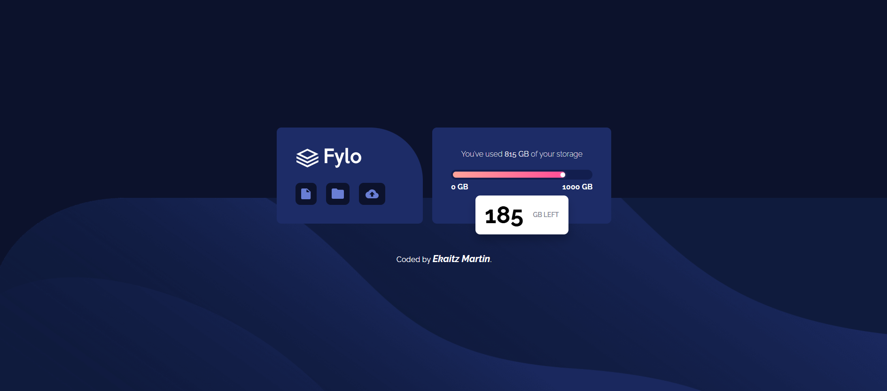
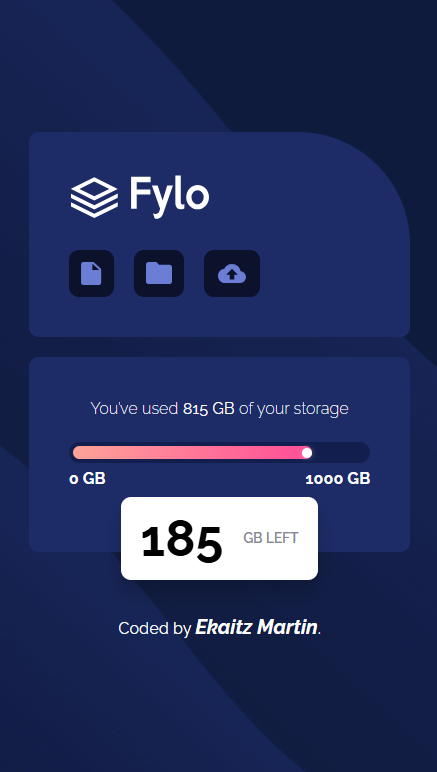

## Table of contents

- [Preview](#-preview)
  - [Links](#links)
  - [Built with](#built-with)
  - [What I learned](#what-i-learned)
  - [Continued development](#continued-development)
  - [Author](#author)

## 🖼 Preview

### 🖥 Desktop 

### 📲 Mobile

### Links

- Solution URL: [Add solution URL here](http://127.0.0.1:5500/fylo-data-storage-component-master/index.html)

### Built with

- Semantic HTML5 markup
- CSS custom properties
- Flexbox & Grid
- Relative and Absolute positions
- z-index
- Mobile-first workflow
- Media queries

### What I learned

This project has been useful to know how make a background with both an image and a color. Moreover, I have practiced key things like z-index, absolute and relative positioning...

### Continued development

My web layout awareness and my CCS and HTML skills are improving a lot doing this type of challenges. 

## Author

- Linkdin - [Ekaitz Martin](https://www.linkedin.com/in/ekaitz-martin-23367727a/)
- Youtube - [@EkaitzMartin29](https://www.youtube.com/@EkaitzMartin29)