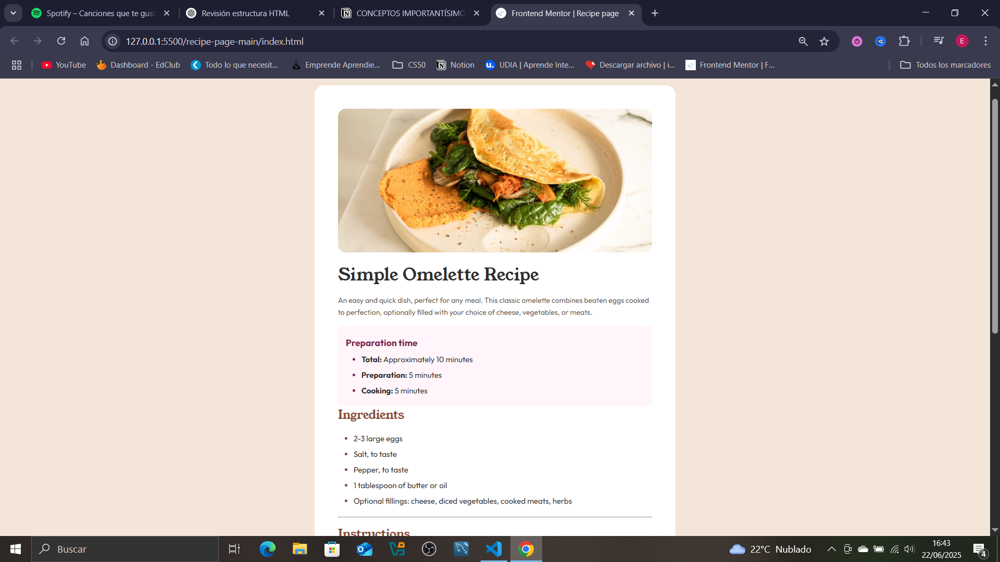

## Table of contents

- [Preview](#-preview)
  - [Links](#links)
  - [Built with](#built-with)
  - [What I learned](#what-i-learned)
  - [Continued development](#continued-development)
  - [Author](#author)

## 🖼 Preview

### Links

- Solution URL: [Add solution URL here](http://127.0.0.1:5500/recipe-page-main/index.html)

### Built with

- Semantic HTML5 markup
- CSS custom properties
- Flexbox
- li elements ::marker properties
- transition and transform properties
- Mobile-first workflow

### What I learned

As this projects layout have been more difficult to get done than previous ones, I have practise how to get a more complex layout, with more content and elements to be aware of. In gerenal It has been a challenge, which has been so useful for me to improve. Moreover I have practice other interesting things such as transitions, lists...

### Continued development

I am focusing my efforts on becoming better at HTML and Css usage, once I feel comfortable enought, I will start including JavaScript in future projects.

## Author

- Linkdin - [Ekaitz Martin](https://www.linkedin.com/in/ekaitz-martin-23367727a/)
- Youtube - [@EkaitzMartin29](https://www.youtube.com/@EkaitzMartin29)